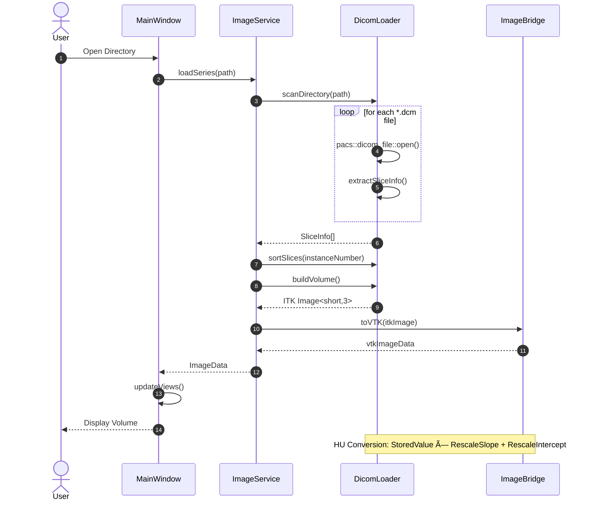

# DICOM Viewer - Software Design Specification (SDS)

> **Version**: 0.2.0
> **Created**: 2025-12-31
> **Last Updated**: 2025-12-31
> **Status**: Draft (Pre-release)
> **Author**: Development Team
> **Based on**: [SRS v0.2.0](SRS.md), [PRD v0.2.0](PRD.md)

---

## Document Information

### Revision History

| Version | Date | Author | Description |
|---------|------|--------|-------------|
| 0.1.0 | 2025-12-31 | Development Team | Initial SDS based on SRS 0.1.0 |
| 0.2.0 | 2025-12-31 | Development Team | Added segmentation and measurement module design |

### Referenced Documents

| Document ID | Title | Location |
|-------------|-------|----------|
| PRD-001 | Product Requirements Document | [PRD.md](PRD.md) |
| SRS-001 | Software Requirements Specification | [SRS.md](SRS.md) |
| REF-001 | ITK Overview | [reference/01-itk-overview.md](reference/01-itk-overview.md) |
| REF-002 | VTK Overview | [reference/02-vtk-overview.md](reference/02-vtk-overview.md) |
| REF-003 | ITK-VTK Integration | [reference/03-itk-vtk-integration.md](reference/03-itk-vtk-integration.md) |
| REF-004 | DICOM Pipeline | [reference/04-dicom-pipeline.md](reference/04-dicom-pipeline.md) |
| REF-005 | PACS Integration | [reference/05-pacs-integration.md](reference/05-pacs-integration.md) |
| REF-006 | GUI Framework Comparison | [reference/06-gui-framework-comparison.md](reference/06-gui-framework-comparison.md) |
| REF-007 | Remote Visualization | [reference/07-remote-visualization.md](reference/07-remote-visualization.md) |

### Design Element ID Convention

- **SDS-ARCH-XXX**: Architectural Design
- **SDS-MOD-XXX**: Module Design
- **SDS-CLS-XXX**: Class Design
- **SDS-IF-XXX**: Interface Design
- **SDS-DATA-XXX**: Data Design
- **SDS-SEQ-XXX**: Sequence Design

---

## 1. Introduction

### 1.1 Purpose

This document is the Software Design Specification (SDS) for the DICOM Viewer software. It provides architecture, module, class, interface, and data design for implementing the software requirements defined in the SRS.

### 1.2 Scope

This document covers the following design aspects:
- System architecture design
- Detailed module design
- Class diagrams and relationships
- Interface definitions
- Data structures and flow
- Sequence diagrams
- Traceability matrix to PRD/SRS

### 1.3 Design Principles

| Principle | Description | Application |
|-----------|-------------|-------------|
| **Separation of Concerns** | Separate responsibilities | Layered architecture, MVC pattern |
| **Dependency Injection** | Inject dependencies | Service layer |
| **Interface Segregation** | Segregate interfaces | Small, focused interfaces |
| **Open/Closed** | Open for extension, closed for modification | Extensible plugin architecture |
| **Single Responsibility** | One responsibility per class | Clear role for each class |

---

## 2. Architectural Design

### SDS-ARCH-001: System Architecture Overview

**Traces to**: SRS System Overview, PRD Section 6

> **Note**: Diagrams are provided in both **Mermaid format** (auto-rendered in GitHub/GitLab) and **ASCII format** (universal compatibility).

#### Mermaid Version (Auto-rendered in GitHub/GitLab)

```mermaid
%%{init: {'theme': 'base', 'themeVariables': { 'primaryColor': '#e1f5fe', 'primaryTextColor': '#01579b', 'primaryBorderColor': '#0288d1', 'lineColor': '#0288d1', 'secondaryColor': '#fff3e0', 'tertiaryColor': '#f3e5f5'}}}%%
flowchart TB
    subgraph PresentationLayer["🖥️ Presentation Layer (Qt6)"]
        direction LR
        MainWindow["MainWindow<br/>• Menu Bar<br/>• Tool Bar<br/>• Status Bar"]
        ViewportWidget["ViewportWidget<br/>• 3D Viewport<br/>• MPR Views<br/>• 2D View"]
        ToolsPanel["ToolsPanel<br/>• Preset Panel<br/>• Measure Panel<br/>• Segment Panel"]
        PatientBrowser["PatientBrowser"]
        PACSQueryDlg["PACSQueryDlg"]
        SettingsDlg["SettingsDlg"]
    end

    subgraph ControllerLayer["⚙️ Controller Layer"]
        direction LR
        ViewerController["ViewerController"]
        LoadingCtrl["LoadingController"]
        RenderCtrl["RenderController"]
        ToolCtrl["ToolController"]
        NetworkCtrl["NetworkController"]
        ViewerController --- LoadingCtrl
        ViewerController --- RenderCtrl
        ViewerController --- ToolCtrl
        ViewerController --- NetworkCtrl
    end

    subgraph ServiceLayer["🔧 Service Layer"]
        direction LR
        ImageService["ImageService<br/>• Loading<br/>• Preprocessing<br/>• Segmentation"]
        RenderService["RenderService<br/>• Volume<br/>• Surface<br/>• MPR"]
        MeasureService["MeasureService<br/>• Distance<br/>• Area/Volume<br/>• Statistics"]
        NetworkService["NetworkService<br/>• C-FIND<br/>• C-MOVE<br/>• C-STORE"]
    end

    subgraph DataLayer["💾 Data Layer"]
        direction LR
        ImageData["ImageData<br/>• ITK Image<br/>• VTK Image"]
        DicomData["DicomData<br/>• pacs_system<br/>• Dataset"]
        MetaData["MetaData<br/>• Patient/Study<br/>• Series"]
        SegmentData["SegmentData<br/>• LabelMap<br/>• ROI"]
    end

    subgraph ExternalLayer["📚 External Libraries"]
        direction LR
        pacs_system["pacs_system<br/>DICOM Core"]
        ITK["ITK<br/>Processing"]
        VTK["VTK<br/>Visualization"]
        Qt6["Qt6<br/>GUI Framework"]
    end

    PresentationLayer --> ControllerLayer
    ControllerLayer --> ServiceLayer
    ServiceLayer --> DataLayer
    DataLayer --> ExternalLayer

    style PresentationLayer fill:#e3f2fd,stroke:#1976d2
    style ControllerLayer fill:#fff3e0,stroke:#f57c00
    style ServiceLayer fill:#e8f5e9,stroke:#388e3c
    style DataLayer fill:#fce4ec,stroke:#c2185b
    style ExternalLayer fill:#f3e5f5,stroke:#7b1fa2
```



#### ASCII Version (Universal Compatibility)

```
┌─────────────────────────────────────────────────────────────────────────────┐
│                       DICOM Viewer System Architecture                        │
├─────────────────────────────────────────────────────────────────────────────┤
│                                                                               │
│  ┌─────────────────────────────────────────────────────────────────────────┐│
│  │                        Presentation Layer (Qt6)                          ││
│  │                                                                           ││
│  │  ┌───────────────┐  ┌────────────────┐  ┌────────────────┐              ││
│  │  │  MainWindow   │  │ ViewportWidget │  │   ToolsPanel   │              ││
│  │  │               │  │                │  │                │              ││
│  │  │ • Menu Bar    │  │ • 3D Viewport  │  │ • Preset Panel │              ││
│  │  │ • Tool Bar    │  │ • MPR Views    │  │ • Measure Panel│              ││
│  │  │ • Status Bar  │  │ • 2D View      │  │ • Segment Panel│              ││
│  │  │ • Dock Areas  │  │ (QVTK Widget)  │  │ • ROI Panel    │              ││
│  │  └───────────────┘  └────────────────┘  └────────────────┘              ││
│  │                                                                           ││
│  │  ┌───────────────┐  ┌────────────────┐  ┌────────────────┐              ││
│  │  │PatientBrowser │  │ PACSQueryDlg   │  │  SettingsDlg   │              ││
│  │  └───────────────┘  └────────────────┘  └────────────────┘              ││
│  │                                                                           ││
│  └─────────────────────────────────────────────────────────────────────────┘│
│                                      │                                        │
│                                      ↓                                        │
│  ┌─────────────────────────────────────────────────────────────────────────┐│
│  │                       Controller Layer                                    ││
│  │                                                                           ││
│  │  ┌───────────────────────────────────────────────────────────────────┐  ││
│  │  │                      ViewerController                              │  ││
│  │  │                                                                     │  ││
│  │  │  ┌──────────────┐ ┌──────────────┐ ┌──────────────┐ ┌────────────┐│  ││
│  │  │  │   Loading    │ │  Rendering   │ │    Tool      │ │  Network   ││  ││
│  │  │  │  Controller  │ │  Controller  │ │  Controller  │ │ Controller ││  ││
│  │  │  └──────────────┘ └──────────────┘ └──────────────┘ └────────────┘│  ││
│  │  └───────────────────────────────────────────────────────────────────┘  ││
│  │                                                                           ││
│  └─────────────────────────────────────────────────────────────────────────┘│
│                                      │                                        │
│                                      ↓                                        │
│  ┌─────────────────────────────────────────────────────────────────────────┐│
│  │                         Service Layer                                     ││
│  │                                                                           ││
│  │  ┌─────────────┐ ┌─────────────┐ ┌─────────────┐ ┌───────────────────┐  ││
│  │  │   Image     │ │   Render    │ │ Measurement │ │    Network        │  ││
│  │  │   Service   │ │   Service   │ │   Service   │ │    Service        │  ││
│  │  │             │ │             │ │             │ │                   │  ││
│  │  │ • Loading   │ │ • Volume    │ │ • Distance  │ │ • C-FIND          │  ││
│  │  │ • Preproc   │ │ • Surface   │ │ • Area/Vol  │ │ • C-MOVE          │  ││
│  │  │ • Segment   │ │ • MPR       │ │ • Statistics│ │ • C-STORE         │  ││
│  │  │ • Convert   │ │ • 2D View   │ │ • ROI Mgmt  │ │ • Echo            │  ││
│  │  └─────────────┘ └─────────────┘ └─────────────┘ └───────────────────┘  ││
│  │                                                                           ││
│  └─────────────────────────────────────────────────────────────────────────┘│
│                                      │                                        │
│                                      ↓                                        │
│  ┌─────────────────────────────────────────────────────────────────────────┐│
│  │                           Data Layer                                      ││
│  │                                                                           ││
│  │  ┌─────────────┐ ┌─────────────┐ ┌─────────────┐ ┌───────────────────┐  ││
│  │  │  ImageData  │ │  DicomData  │ │  MetaData   │ │  SegmentData      │  ││
│  │  │             │ │             │ │             │ │                   │  ││
│  │  │ • ITK Image │ │ • pacs_sys  │ │ • Patient   │ │ • LabelMap        │  ││
│  │  │ • VTK Image │ │   Dataset   │ │ • Study     │ │ • ROI Collection  │  ││
│  │  │ • Bridge    │ │             │ │ • Series    │ │ • Measurements    │  ││
│  │  └─────────────┘ └─────────────┘ └─────────────┘ └───────────────────┘  ││
│  │                                                                           ││
│  └─────────────────────────────────────────────────────────────────────────┘│
│                                      │                                        │
│                                      ↓                                        │
│  ┌─────────────────────────────────────────────────────────────────────────┐│
│  │                      External Libraries Layer                             ││
│  │                                                                           ││
│  │  ┌─────────────┐ ┌─────────────┐ ┌─────────────┐ ┌───────────────────┐  ││
│  │  │ pacs_system │ │     ITK     │ │     VTK     │ │       Qt6         │  ││
│  │  │             │ │             │ │             │ │                   │  ││
│  │  │ DICOM Core  │ │ Processing  │ │ Visualiz.   │ │ GUI Framework     │  ││
│  │  │ Network     │ │ Segmentation│ │ Rendering   │ │ Widgets           │  ││
│  │  │ Codecs      │ │ Registration│ │ Interaction │ │ OpenGL            │  ││
│  │  └─────────────┘ └─────────────┘ └─────────────┘ └───────────────────┘  ││
│  │                                                                           ││
│  └─────────────────────────────────────────────────────────────────────────┘│
│                                                                               │
└─────────────────────────────────────────────────────────────────────────────┘
```

---

### SDS-ARCH-002: Layer Responsibilities

**Traces to**: SRS-FR-001 through SRS-FR-050

| Layer | Responsibility | Key Technologies | Dependencies |
|-------|---------------|------------------|--------------|
| **Presentation** | UI rendering, user input handling | Qt6, QVTKOpenGLNativeWidget | Controller |
| **Controller** | Request coordination, event handling | C++ | Service |
| **Service** | Business logic, image processing | ITK, VTK | Data |
| **Data** | Data storage, conversion, management | pacs_system | External Libs |
| **External Libs** | Foundation functionality | ITK, VTK, Qt6, pacs_system | OS |

---

### SDS-ARCH-003: Module Dependency Graph

**Traces to**: PRD Section 6.2

#### Mermaid Version


#### ASCII Version

```
┌─────────────────────────────────────────────────────────────────────────────┐
│                         Module Dependency Graph                               │
├─────────────────────────────────────────────────────────────────────────────┤
│                                                                               │
│   dicom_viewer_app  ──────────────────────────────────────────────────┐      │
│         │                                                              │      │
│         ↓                                                              │      │
│   dicom_viewer_ui                                                      │      │
│         │                                                              │      │
│         ↓                                                              │      │
│   dicom_viewer_controller  ←───────────────────────────────────────────┘      │
│         │                                                                     │
│         ├─────────────────┬─────────────────┬─────────────────┐              │
│         ↓                 ↓                 ↓                 ↓              │
│   image_service     render_service    network_service   measurement_service  │
│         │                 │                 │                 │              │
│         └─────────────────┴─────────────────┴─────────────────┘              │
│                                   │                                          │
│                                   ↓                                          │
│                         dicom_viewer_core                                    │
│                                   │                                          │
│         ┌─────────────────────────┼─────────────────────────┐               │
│         ↓                         ↓                         ↓               │
│    pacs_system                   ITK                       VTK              │
│         │                         │                         │               │
│         └─────────────────────────┴─────────────────────────┘               │
│                                   │                                          │
│                                   ↓                                          │
│                                  Qt6                                         │
│                                                                               │
└─────────────────────────────────────────────────────────────────────────────┘
```

---

### SDS-ARCH-004: Data Flow Architecture

**Traces to**: SRS-FR-001, SRS-FR-002, SRS-FR-005

#### Mermaid Version


#### ASCII Version

```
┌─────────────────────────────────────────────────────────────────────────────┐
│                           Data Flow Pipeline                                  │
├─────────────────────────────────────────────────────────────────────────────┤
│                                                                               │
│   ┌───────────┐     ┌───────────┐     ┌───────────┐     ┌───────────────┐   │
│   │  DICOM    │     │   PACS    │     │   ITK     │     │     VTK       │   │
│   │  Files    │     │  Dataset  │     │   Image   │     │  ImageData    │   │
│   │           │     │           │     │           │     │               │   │
│   │  (*.dcm)  │ ──→ │ dicom_    │ ──→ │ itk::     │ ──→ │ vtkImageData  │   │
│   │           │     │ dataset   │     │ Image<>   │     │               │   │
│   └───────────┘     └───────────┘     └───────────┘     └───────────────┘   │
│        │                  │                  │                  │            │
│        │ pacs_system      │ PACSToITK       │ ITKVtkGlue       │ VTK        │
│        │ dicom_file::     │ Adapter         │ Connector        │ Mapper     │
│        │ open()           │                  │                  │            │
│        │                  │                  │                  ↓            │
│        │                  │                  │          ┌───────────────┐   │
│        │                  │                  │          │    Render     │   │
│        │                  │                  │          │    Output     │   │
│        │                  │                  │          │               │   │
│        │                  │                  │          │ • Volume      │   │
│        │                  │                  │          │ • Surface     │   │
│        │                  │                  │          │ • MPR         │   │
│        │                  │                  │          │ • 2D          │   │
│        │                  │                  │          └───────────────┘   │
│        │                  │                  │                               │
│        │                  │                  ↓                               │
│        │                  │          ┌───────────────┐                      │
│        │                  │          │  Processing   │                      │
│        │                  │          │               │                      │
│        │                  │          │ • Filtering   │                      │
│        │                  │          │ • Segmentation│                      │
│        │                  │          │ • Registration│                      │
│        │                  │          └───────────────┘                      │
│        │                  │                                                  │
│        ↓                  ↓                                                  │
│   ┌─────────────────────────────────────────────────────────────────────┐   │
│   │                        Metadata Storage                              │   │
│   │                                                                       │   │
│   │   Patient Info  │  Study Info  │  Series Info  │  Image Info        │   │
│   │                                                                       │   │
│   └─────────────────────────────────────────────────────────────────────┘   │
│                                                                               │
└─────────────────────────────────────────────────────────────────────────────┘
```

---

### SDS-ARCH-005: Remote Visualization Architecture (Alternative)

**Traces to**: REF-007, PRD Section 6

**Purpose**: Server-side rendering + image streaming architecture option for platform-independent medical image viewing

> **Note**: This architecture is an alternative approach that enables viewing medical images without GPU on various platforms such as web, iOS, Android, and desktop. For detailed implementation, see [REF-007: Remote Visualization](reference/07-remote-visualization.md).

#### Architecture Comparison

| Aspect | Desktop Architecture (Default) | Remote Visualization Architecture |
|--------|-------------------------------|-----------------------------------|
| **Rendering Location** | Client (Local GPU) | Server (Central GPU) |
| **Data Transfer** | DICOM file download | Image stream (JPEG/H.264) |
| **Client Requirements** | GPU, VTK library | Web browser or lightweight app |
| **Bandwidth Usage** | High (initial download) | Medium (continuous streaming) |
| **Security** | Local data storage | PHI retained on server (HIPAA-friendly) |
| **Scalability** | Independent per client | Shared GPU cluster |

#### Remote Visualization System Diagram

```
┌─────────────────────────────────────────────────────────────────────────────┐
│                    Remote Visualization Architecture                         │
├─────────────────────────────────────────────────────────────────────────────┤
│                                                                               │
│   Client Side (Any Platform)          Server Side (VTK Backend)              │
│   ─────────────────────────           ────────────────────────               │
│                                                                               │
│   ┌───────────────────────┐           ┌─────────────────────────────────┐   │
│   │  📱 Mobile App         │           │        VTK Render Server        │   │
│   │  🌐 Web Browser        │           │                                 │   │
│   │  💻 Desktop Thin Client│   WS      │  ┌─────────────────────────┐   │   │
│   │  📺 Smart TV           │ ◄────────►│  │  vtkRenderWindow        │   │   │
│   └───────────────────────┘  Events    │  │  (Offscreen Rendering)  │   │   │
│            │                           │  └─────────────────────────┘   │   │
│            │                           │              │                 │   │
│            │       Image Stream        │              ▼                 │   │
│            │ ◄─────────────────────────│  ┌─────────────────────────┐   │   │
│            │     (JPEG/H.264)          │  │  Image Encoder          │   │   │
│            │                           │  │  (JPEG/WebP/H.264)      │   │   │
│            ▼                           │  └─────────────────────────┘   │   │
│   ┌───────────────────────┐           │              │                 │   │
│   │  Display Layer        │           │              ▼                 │   │
│   │  • <canvas>           │           │  ┌─────────────────────────┐   │   │
│   │  • <video>            │           │  │  ITK + pacs_system      │   │   │
│   │  • Native View        │           │  │  (Processing Layer)     │   │   │
│   └───────────────────────┘           │  └─────────────────────────┘   │   │
│                                        └─────────────────────────────────┘   │
│                                                                               │
└─────────────────────────────────────────────────────────────────────────────┘
```

#### Key Components

| Component | Responsibility | Technology |
|-----------|----------------|------------|
| **RenderServer** | Offscreen VTK rendering, camera manipulation | VTK, vtkRenderWindow |
| **StreamingServer** | WebSocket communication, session management, frame streaming | WebSocket++, nlohmann/json |
| **AdaptiveQualityManager** | Quality adjustment based on network conditions | Custom |
| **ImageEncoder** | JPEG/WebP/H.264 encoding | libjpeg, libwebp, NVENC |

#### When to Use Remote Visualization

| Use Case | Recommended Architecture |
|----------|-------------------------|
| High-performance workstation diagnosis | Desktop (Default) |
| Telemedicine / Collaboration | Remote Visualization |
| Mobile reference | Remote Visualization |
| Large datasets (>1GB) | Remote Visualization |
| Offline environment | Desktop (Default) |
| Web-based PACS integration | Remote Visualization |

#### Implementation Reference

For detailed implementation code, client examples (React, Flutter), and deployment configuration (Docker, Kubernetes), see the following documentation:

- **[REF-007: Remote Visualization Architecture](reference/07-remote-visualization.md)** - Complete architecture and implementation guide

---

## 3. Module Design

### SDS-MOD-001: Core Module (dicom_viewer_core)

**Traces to**: SRS-FR-001, SRS-FR-002, SRS-FR-003, SRS-FR-004

**Purpose**: Provide common data structures, utilities, and type definitions

**Components**:

| Component | Description | File Location |
|-----------|-------------|---------------|
| Types | Common type definitions | `include/core/types.hpp` |
| ImageBridge | ITK-VTK conversion | `include/core/image_bridge.hpp` |
| MetadataStore | Metadata storage | `include/core/metadata_store.hpp` |
| CoordinateSystem | Coordinate system conversion | `include/core/coordinate_system.hpp` |
| TransferFunction | Transfer Function management | `include/core/transfer_function.hpp` |

**Class Diagram**:

#### Mermaid Version


#### ASCII Version

```
┌─────────────────────────────────────────────────────────────────────────────┐
│                        Core Module Class Diagram                             │
├─────────────────────────────────────────────────────────────────────────────┤
│                                                                               │
│   ┌───────────────────────────────────┐                                      │
│   │           ImageTypes              │                                      │
│   ├───────────────────────────────────┤                                      │
│   │ using ITKImageType3D =            │                                      │
│   │   itk::Image<short, 3>            │                                      │
│   │ using ITKMaskType3D =             │                                      │
│   │   itk::Image<uint8_t, 3>          │                                      │
│   │ using ITKFloatType3D =            │                                      │
│   │   itk::Image<float, 3>            │                                      │
│   └───────────────────────────────────┘                                      │
│                                                                               │
│   ┌───────────────────────────────────┐    ┌───────────────────────────────┐│
│   │         ImageBridge               │    │      MetadataStore            ││
│   ├───────────────────────────────────┤    ├───────────────────────────────┤│
│   │ + toVTK(itk::Image) : vtkImageData│    │ - m_patients : vector<Patient>││
│   │ + toITK(vtkImageData) : itk::Image│    │ - m_studies : vector<Study>   ││
│   │ + syncDirection()                 │    │ + addPatient()                ││
│   │ + preserveMetadata()              │    │ + findStudies()               ││
│   ├───────────────────────────────────┤    │ + getMetadata(tag)            ││
│   │ - m_itkToVtkConnector             │    └───────────────────────────────┘│
│   │ - m_vtkToItkConnector             │                                      │
│   └───────────────────────────────────┘                                      │
│                                                                               │
│   ┌───────────────────────────────────┐    ┌───────────────────────────────┐│
│   │     TransferFunctionPreset        │    │    CoordinateConverter        ││
│   ├───────────────────────────────────┤    ├───────────────────────────────┤│
│   │ + name : string                   │    │ + lpsToRas(point) : Point3D   ││
│   │ + colorPoints : vector<ColorPoint>│    │ + rasToLps(point) : Point3D   ││
│   │ + opacityPoints : vector<OpPoint> │    │ + imageToPhysical()           ││
│   │ + windowWidth : double            │    │ + physicalToImage()           ││
│   │ + windowCenter : double           │    └───────────────────────────────┘│
│   └───────────────────────────────────┘                                      │
│                                                                               │
└─────────────────────────────────────────────────────────────────────────────┘
```

---

### SDS-MOD-002: Image Service Module

**Traces to**: SRS-FR-001 ~ SRS-FR-004, SRS-FR-016 ~ SRS-FR-030

**Purpose**: Provide DICOM loading, preprocessing, segmentation, and conversion functionality

**Components**:

| Component | Description | Traces to |
|-----------|-------------|-----------|
| DicomLoader | DICOM file/series loading | SRS-FR-001, SRS-FR-002 |
| CodecManager | Transfer Syntax decoding | SRS-FR-003 |
| Preprocessor | Image preprocessing filters | SRS-FR-016 ~ SRS-FR-020 |
| Segmentor | Segmentation algorithms | SRS-FR-021 ~ SRS-FR-035 |
| HUConverter | HU value conversion | SRS-FR-004 |

**Class Diagram**:

#### Mermaid Version


#### ASCII Version

```
┌─────────────────────────────────────────────────────────────────────────────┐
│                     Image Service Module Class Diagram                       │
├─────────────────────────────────────────────────────────────────────────────┤
│                                                                               │
│   ┌─────────────────────────────────────────────────────────────────────┐   │
│   │                         IImageService <<interface>>                  │   │
│   ├─────────────────────────────────────────────────────────────────────┤   │
│   │ + loadSeries(path) : Result<ImageData>                              │   │
│   │ + loadFile(path) : Result<ImageData>                                │   │
│   │ + applyFilter(image, filter) : ImageData                            │   │
│   │ + segment(image, params) : MaskData                                 │   │
│   │ + convertToHU(image) : ImageData                                    │   │
│   └─────────────────────────────────────────────────────────────────────┘   │
│                                      △                                       │
│                                      │                                       │
│   ┌─────────────────────────────────────────────────────────────────────┐   │
│   │                         ImageService                                 │   │
│   ├─────────────────────────────────────────────────────────────────────┤   │
│   │ - m_loader : unique_ptr<DicomLoader>                                │   │
│   │ - m_preprocessor : unique_ptr<Preprocessor>                         │   │
│   │ - m_segmentor : unique_ptr<Segmentor>                               │   │
│   │ - m_codecManager : unique_ptr<CodecManager>                         │   │
│   ├─────────────────────────────────────────────────────────────────────┤   │
│   │ + loadSeries(path) : Result<ImageData>                              │   │
│   │ + loadFile(path) : Result<ImageData>                                │   │
│   │ + applyGaussian(sigma) : ImageData                                  │   │
│   │ + applyAnisotropic(iterations, conductance) : ImageData             │   │
│   │ + segmentThreshold(lower, upper) : MaskData                         │   │
│   │ + segmentRegionGrow(seed, tolerance) : MaskData                     │   │
│   │ + segmentLevelSet(params) : MaskData                                │   │
│   │ + applyMorphology(operation, radius) : MaskData                     │   │
│   └─────────────────────────────────────────────────────────────────────┘   │
│                                      │                                       │
│              ┌───────────────────────┼───────────────────────┐              │
│              │                       │                       │              │
│              ↓                       ↓                       ↓              │
│   ┌─────────────────┐    ┌─────────────────┐    ┌─────────────────────┐    │
│   │   DicomLoader   │    │   Preprocessor  │    │     Segmentor       │    │
│   ├─────────────────┤    ├─────────────────┤    ├─────────────────────┤    │
│   │ + loadFromDir() │    │ + gaussian()    │    │ + threshold()       │    │
│   │ + loadFromFile()│    │ + anisotropic() │    │ + otsu()            │    │
│   │ + sortSlices()  │    │ + histogramEq() │    │ + regionGrow()      │    │
│   │ + buildVolume() │    │ + n4BiasCorr()  │    │ + confidenceConn()  │    │
│   └─────────────────┘    │ + resample()    │    │ + levelSet()        │    │
│           │              └─────────────────┘    │ + watershed()       │    │
│           │                                     │ + morphology()      │    │
│           ↓                                     └─────────────────────┘    │
│   ┌─────────────────┐                                                       │
│   │  CodecManager   │                                                       │
│   ├─────────────────┤                                                       │
│   │ + decode(data,  │                                                       │
│   │   transferSyn.) │                                                       │
│   │ + isSupported() │                                                       │
│   │ + getCodec()    │                                                       │
│   └─────────────────┘                                                       │
│                                                                               │
└─────────────────────────────────────────────────────────────────────────────┘
```

---

### SDS-MOD-003: Render Service Module

**Traces to**: SRS-FR-005 ~ SRS-FR-015

**Purpose**: Provide volume rendering, surface rendering, MPR, and 2D view functionality

**Components**:

| Component | Description | Traces to |
|-----------|-------------|-----------|
| VolumeRenderer | GPU volume rendering | SRS-FR-005, SRS-FR-006 |
| SurfaceRenderer | Isosurface extraction and rendering | SRS-FR-012 ~ SRS-FR-015 |
| MPRRenderer | Multiplanar reconstruction | SRS-FR-008 ~ SRS-FR-011 |
| SliceViewer | 2D slice view | SRS-FR-042 ~ SRS-FR-044 |
| TransferFunctionManager | Transfer Function management | SRS-FR-006 |

**Class Diagram**:

```
┌─────────────────────────────────────────────────────────────────────────────┐
│                     Render Service Module Class Diagram                      │
├─────────────────────────────────────────────────────────────────────────────┤
│                                                                               │
│   ┌─────────────────────────────────────────────────────────────────────┐   │
│   │                       IRenderService <<interface>>                   │   │
│   ├─────────────────────────────────────────────────────────────────────┤   │
│   │ + setImageData(data : vtkImageData)                                 │   │
│   │ + renderVolume(preset : TransferFunctionPreset)                     │   │
│   │ + renderSurface(threshold : double)                                 │   │
│   │ + renderMPR(orientation : MPROrientation)                           │   │
│   │ + render2D(slice : int)                                             │   │
│   └─────────────────────────────────────────────────────────────────────┘   │
│                                      △                                       │
│                                      │                                       │
│   ┌─────────────────────────────────────────────────────────────────────┐   │
│   │                          RenderService                               │   │
│   ├─────────────────────────────────────────────────────────────────────┤   │
│   │ - m_volumeRenderer : unique_ptr<VolumeRenderer>                     │   │
│   │ - m_surfaceRenderer : unique_ptr<SurfaceRenderer>                   │   │
│   │ - m_mprRenderer : unique_ptr<MPRRenderer>                           │   │
│   │ - m_sliceViewer : unique_ptr<SliceViewer>                           │   │
│   │ - m_tfManager : unique_ptr<TransferFunctionManager>                 │   │
│   ├─────────────────────────────────────────────────────────────────────┤   │
│   │ + setImageData(data)                                                │   │
│   │ + setMaskData(mask)                                                 │   │
│   │ + setRenderWindow(window)                                           │   │
│   │ + renderVolume(preset)                                              │   │
│   │ + renderSurface(threshold, color, opacity)                          │   │
│   │ + renderMultiSurface(surfaces)                                      │   │
│   │ + renderMPR(orientation, slice)                                     │   │
│   │ + setWindowLevel(window, level)                                     │   │
│   │ + setClippingBox(bounds)                                            │   │
│   └─────────────────────────────────────────────────────────────────────┘   │
│                                      │                                       │
│         ┌────────────────────────────┼────────────────────────────┐         │
│         │                            │                            │         │
│         ↓                            ↓                            ↓         │
│   ┌───────────────┐       ┌────────────────────┐      ┌─────────────────┐  │
│   │VolumeRenderer │       │  SurfaceRenderer   │      │   MPRRenderer   │  │
│   ├───────────────┤       ├────────────────────┤      ├─────────────────┤  │
│   │- m_mapper     │       │- m_marchingCubes   │      │- m_reslice[3]   │  │
│   │- m_volume     │       │- m_smoother        │      │- m_viewer[3]    │  │
│   │- m_property   │       │- m_decimator       │      │- m_crosshair    │  │
│   │- m_colorTF    │       │- m_actors[]        │      ├─────────────────┤  │
│   │- m_opacityTF  │       ├────────────────────┤      │+ setSlice()     │  │
│   ├───────────────┤       │+ extract(thresh)   │      │+ setOrientation │  │
│   │+ render()     │       │+ smooth(iter)      │      │+ syncCrosshair()│  │
│   │+ setPreset()  │       │+ decimate(ratio)   │      │+ setWindowLevel │  │
│   │+ setClipBox() │       │+ setColor(color)   │      │+ getThickSlab() │  │
│   │+ setMIP()     │       │+ exportSTL(path)   │      └─────────────────┘  │
│   └───────────────┘       │+ exportPLY(path)   │                           │
│                           └────────────────────┘                           │
│                                                                               │
│   ┌───────────────────────────────────────────────────────────────────┐     │
│   │              TransferFunctionManager                               │     │
│   ├───────────────────────────────────────────────────────────────────┤     │
│   │ - m_presets : map<string, TransferFunctionPreset>                 │     │
│   │ - m_currentPreset : string                                        │     │
│   ├───────────────────────────────────────────────────────────────────┤     │
│   │ + loadPresets()                                                   │     │
│   │ + getPreset(name) : TransferFunctionPreset                        │     │
│   │ + saveCustomPreset(name, preset)                                  │     │
│   │ + applyPreset(name, volumeProperty)                               │     │
│   │ + getPresetNames() : vector<string>                               │     │
│   └───────────────────────────────────────────────────────────────────┘     │
│                                                                               │
└─────────────────────────────────────────────────────────────────────────────┘
```

---

### SDS-MOD-004: Measurement Service Module

**Traces to**: SRS-FR-036 ~ SRS-FR-048

**Purpose**: Distance, angle, area, volume measurement and ROI management

**Components**:

| Component | Description | Traces to |
|-----------|-------------|-----------|
| LinearMeasurement | Distance, angle measurement | SRS-FR-036 ~ SRS-FR-038 |
| AreaMeasurement | Area measurement, ROI | SRS-FR-039 ~ SRS-FR-041 |
| VolumeMeasurement | Volume measurement | SRS-FR-042 ~ SRS-FR-045 |
| StatisticsCalculator | Statistics analysis | SRS-FR-046 ~ SRS-FR-048 |
| ROIManager | ROI management | SRS-FR-049 |

**Class Diagram**:

```
┌─────────────────────────────────────────────────────────────────────────────┐
│                   Measurement Service Module Class Diagram                   │
├─────────────────────────────────────────────────────────────────────────────┤
│                                                                               │
│   ┌─────────────────────────────────────────────────────────────────────┐   │
│   │                   IMeasurementService <<interface>>                  │   │
│   ├─────────────────────────────────────────────────────────────────────┤   │
│   │ + measureDistance(p1, p2) : double                                  │   │
│   │ + measureAngle(p1, p2, p3) : double                                 │   │
│   │ + measureArea(roi) : double                                         │   │
│   │ + measureVolume(mask) : double                                      │   │
│   │ + calculateStatistics(image, mask) : Statistics                     │   │
│   └─────────────────────────────────────────────────────────────────────┘   │
│                                      △                                       │
│                                      │                                       │
│   ┌─────────────────────────────────────────────────────────────────────┐   │
│   │                       MeasurementService                             │   │
│   ├─────────────────────────────────────────────────────────────────────┤   │
│   │ - m_linearMeasure : unique_ptr<LinearMeasurement>                   │   │
│   │ - m_areaMeasure : unique_ptr<AreaMeasurement>                       │   │
│   │ - m_volumeMeasure : unique_ptr<VolumeMeasurement>                   │   │
│   │ - m_statsCalc : unique_ptr<StatisticsCalculator>                    │   │
│   │ - m_roiManager : unique_ptr<ROIManager>                             │   │
│   ├─────────────────────────────────────────────────────────────────────┤   │
│   │ + measureDistance(p1, p2) : MeasureResult                           │   │
│   │ + measureAngle(p1, p2, p3) : MeasureResult                          │   │
│   │ + measureCobbAngle(lines) : MeasureResult                           │   │
│   │ + createEllipseROI(center, axes) : ROI                              │   │
│   │ + createPolygonROI(points) : ROI                                    │   │
│   │ + createFreehandROI(points) : ROI                                   │   │
│   │ + calculateROIArea(roi) : double                                    │   │
│   │ + calculateROIPerimeter(roi) : double                               │   │
│   │ + calculateMaskVolume(mask) : VolumeResult                          │   │
│   │ + calculateMaskSurfaceArea(mask) : double                           │   │
│   │ + calculateROIStatistics(image, roi) : Statistics                   │   │
│   │ + calculateHistogram(image, roi) : Histogram                        │   │
│   │ + generateReport() : AnalysisReport                                 │   │
│   └─────────────────────────────────────────────────────────────────────┘   │
│                                                                               │
│   ┌─────────────────────┐    ┌─────────────────────┐                        │
│   │  LinearMeasurement  │    │   AreaMeasurement   │                        │
│   ├─────────────────────┤    ├─────────────────────┤                        │
│   │ + distance(p1, p2)  │    │ + ellipseArea()     │                        │
│   │ + angle(p1, p2, p3) │    │ + polygonArea()     │                        │
│   │ + cobbAngle()       │    │ + freehandArea()    │                        │
│   │ + multiDistance()   │    │ + perimeter()       │                        │
│   └─────────────────────┘    └─────────────────────┘                        │
│                                                                               │
│   ┌─────────────────────┐    ┌─────────────────────┐                        │
│   │  VolumeMeasurement  │    │StatisticsCalculator │                        │
│   ├─────────────────────┤    ├─────────────────────┤                        │
│   │ + voxelCount()      │    │ + mean()            │                        │
│   │ + volumeMm3()       │    │ + stdDev()          │                        │
│   │ + volumeCm3()       │    │ + min() / max()     │                        │
│   │ + surfaceArea()     │    │ + median()          │                        │
│   │ + boundingBox()     │    │ + histogram()       │                        │
│   │ + centroid()        │    │ + percentiles()     │                        │
│   │ + sphericity()      │    └─────────────────────┘                        │
│   │ + elongation()      │                                                    │
│   └─────────────────────┘                                                    │
│                                                                               │
│   ┌─────────────────────────────────────────────────────────────────────┐   │
│   │                          ROIManager                                  │   │
│   ├─────────────────────────────────────────────────────────────────────┤   │
│   │ - m_rois : vector<unique_ptr<ROI>>                                  │   │
│   │ - m_selectedIndex : int                                             │   │
│   ├─────────────────────────────────────────────────────────────────────┤   │
│   │ + addROI(roi) : int                                                 │   │
│   │ + removeROI(index)                                                  │   │
│   │ + getROI(index) : ROI&                                              │   │
│   │ + selectROI(index)                                                  │   │
│   │ + setROIName(index, name)                                           │   │
│   │ + setROIColor(index, color)                                         │   │
│   │ + setROIVisible(index, visible)                                     │   │
│   │ + copyROI(srcIndex, destSlice)                                      │   │
│   │ + saveROIs(path)                                                    │   │
│   │ + loadROIs(path)                                                    │   │
│   │ + getAllROIs() : vector<ROI>                                        │   │
│   └─────────────────────────────────────────────────────────────────────┘   │
│                                                                               │
└─────────────────────────────────────────────────────────────────────────────┘
```

---

### SDS-MOD-005: Network Service Module

**Traces to**: SRS-FR-050 ~ SRS-FR-054

**Purpose**: PACS integration (C-FIND, C-MOVE, C-STORE, C-ECHO)

**Components**:

| Component | Description | Traces to |
|-----------|-------------|-----------|
| QueryClient | C-FIND SCU | SRS-FR-051 |
| RetrieveClient | C-MOVE SCU | SRS-FR-052 |
| StorageServer | C-STORE SCP | SRS-FR-053 |
| EchoClient | C-ECHO SCU | SRS-FR-050 |
| PACSConfigManager | PACS configuration management | SRS-FR-054 |

**Class Diagram**:

```
┌─────────────────────────────────────────────────────────────────────────────┐
│                    Network Service Module Class Diagram                      │
├─────────────────────────────────────────────────────────────────────────────┤
│                                                                               │
│   ┌─────────────────────────────────────────────────────────────────────┐   │
│   │                    INetworkService <<interface>>                     │   │
│   ├─────────────────────────────────────────────────────────────────────┤   │
│   │ + echo(server) : bool                                               │   │
│   │ + find(server, query) : vector<DicomDataset>                        │   │
│   │ + move(server, query, destAE) : bool                                │   │
│   │ + startStorageSCP(config) : bool                                    │   │
│   │ + stopStorageSCP()                                                  │   │
│   └─────────────────────────────────────────────────────────────────────┘   │
│                                      △                                       │
│                                      │                                       │
│   ┌─────────────────────────────────────────────────────────────────────┐   │
│   │                         NetworkService                               │   │
│   ├─────────────────────────────────────────────────────────────────────┤   │
│   │ - m_echoClient : unique_ptr<EchoClient>                             │   │
│   │ - m_queryClient : unique_ptr<QueryClient>                           │   │
│   │ - m_retrieveClient : unique_ptr<RetrieveClient>                     │   │
│   │ - m_storageServer : unique_ptr<StorageServer>                       │   │
│   │ - m_configManager : unique_ptr<PACSConfigManager>                   │   │
│   ├─────────────────────────────────────────────────────────────────────┤   │
│   │ + verifyConnection(server) : bool                                   │   │
│   │ + queryPatients(server, criteria) : vector<PatientInfo>             │   │
│   │ + queryStudies(server, patientId) : vector<StudyInfo>               │   │
│   │ + querySeries(server, studyUid) : vector<SeriesInfo>                │   │
│   │ + retrieveStudy(server, studyUid, destDir) : bool                   │   │
│   │ + retrieveSeries(server, seriesUid, destDir) : bool                 │   │
│   │ + startReceiver(port, storageDir) : bool                            │   │
│   │ + stopReceiver()                                                    │   │
│   │ + getServerList() : vector<PACSServerConfig>                        │   │
│   │ + addServer(config)                                                 │   │
│   │ + removeServer(name)                                                │   │
│   └─────────────────────────────────────────────────────────────────────┘   │
│                                                                               │
│   ┌─────────────────────┐  ┌─────────────────────┐  ┌─────────────────────┐│
│   │    QueryClient      │  │   RetrieveClient    │  │   StorageServer     ││
│   ├─────────────────────┤  ├─────────────────────┤  ├─────────────────────┤│
│   │ + findPatient()     │  │ + moveStudy()       │  │ + start()           ││
│   │ + findStudy()       │  │ + moveSeries()      │  │ + stop()            ││
│   │ + findSeries()      │  │ + moveImage()       │  │ + onImageReceived() ││
│   │ + findImage()       │  │ + setDestAE()       │  │ + setStoragePath()  ││
│   └─────────────────────┘  └─────────────────────┘  └─────────────────────┘│
│                                                                               │
│   ┌─────────────────────────────────────────────────────────────────────┐   │
│   │                       PACSServerConfig                               │   │
│   ├─────────────────────────────────────────────────────────────────────┤   │
│   │ + name : string                                                     │   │
│   │ + aeTitle : string                                                  │   │
│   │ + host : string                                                     │   │
│   │ + port : uint16_t                                                   │   │
│   │ + useTLS : bool                                                     │   │
│   │ + timeout : int                                                     │   │
│   └─────────────────────────────────────────────────────────────────────┘   │
│                                                                               │
└─────────────────────────────────────────────────────────────────────────────┘
```

---

### SDS-MOD-006: UI Module

**Traces to**: SRS-FR-055 ~ SRS-FR-060

**Purpose**: Provide Qt6-based user interface

**Components**:

| Component | Description | Traces to | Status |
|-----------|-------------|-----------|--------|
| MainWindow | Main window with dockable panels, dark theme | SRS-FR-055 | ✅ Implemented |
| ViewportWidget | VTK rendering widget with QVTKOpenGLNativeWidget | SRS-FR-056 | ✅ Implemented |
| PatientBrowser | Patient/study/series tree browser with search | SRS-FR-057 | ✅ Implemented |
| ToolsPanel | Window/level controls, presets, visualization modes | SRS-FR-058 | ✅ Implemented |
| SegmentationPanel | Segmentation tools panel | SRS-FR-024 | ⏳ Planned |
| MeasurementPanel | Measurement tools panel | SRS-FR-036 | ⏳ Planned |

**Widget Hierarchy**:

```
┌─────────────────────────────────────────────────────────────────────────────┐
│                          UI Widget Hierarchy                                  │
├─────────────────────────────────────────────────────────────────────────────┤
│                                                                               │
│   MainWindow (QMainWindow)                                                   │
│   │                                                                          │
│   ├── MenuBar (QMenuBar)                                                     │
│   │   ├── File Menu (Open, Save, Export, Close, Exit)                        │
│   │   ├── Edit Menu (Undo, Redo, Preferences)                                │
│   │   ├── View Menu (Layout, Presets, Window/Level)                          │
│   │   ├── Tools Menu (Measure, Segment, Annotations)                         │
│   │   ├── PACS Menu (Query, Retrieve, Send)                                  │
│   │   └── Help Menu (About, Manual)                                          │
│   │                                                                          │
│   ├── ToolBar (QToolBar)                                                     │
│   │   ├── Open Button                                                        │
│   │   ├── Save Button                                                        │
│   │   ├── PACS Button                                                        │
│   │   ├── Separator                                                          │
│   │   ├── Scroll Tool                                                        │
│   │   ├── Zoom Tool                                                          │
│   │   ├── Pan Tool                                                           │
│   │   ├── Window/Level Tool                                                  │
│   │   ├── Separator                                                          │
│   │   ├── Distance Tool                                                      │
│   │   ├── Angle Tool                                                         │
│   │   ├── ROI Tool                                                           │
│   │   ├── Separator                                                          │
│   │   └── Segmentation Tool                                                  │
│   │                                                                          │
│   ├── Central Widget (QSplitter)                                             │
│   │   │                                                                      │
│   │   ├── Left Dock: PatientBrowser (QDockWidget)                            │
│   │   │   ├── Patient Tree (QTreeView)                                       │
│   │   │   │   ├── Patient Node                                               │
│   │   │   │   │   ├── Study Node                                             │
│   │   │   │   │   │   └── Series Node                                        │
│   │   │   │   │   │       └── Image Count                                    │
│   │   │   └── Series Thumbnail (QListView)                                   │
│   │   │                                                                      │
│   │   ├── Center: ViewportContainer                                          │
│   │   │   │                                                                  │
│   │   │   ├── Layout 1x1: Single Viewport                                    │
│   │   │   │   └── QVTKOpenGLNativeWidget                                     │
│   │   │   │                                                                  │
│   │   │   ├── Layout 2x2: MPR + 3D                                           │
│   │   │   │   ├── Axial View (Top-Left)                                      │
│   │   │   │   ├── Coronal View (Top-Right)                                   │
│   │   │   │   ├── Sagittal View (Bottom-Left)                                │
│   │   │   │   └── 3D View (Bottom-Right)                                     │
│   │   │   │                                                                  │
│   │   │   └── Layout 1x3: MPR Only                                           │
│   │   │       ├── Axial View                                                 │
│   │   │       ├── Coronal View                                               │
│   │   │       └── Sagittal View                                              │
│   │   │                                                                      │
│   │   └── Right Dock: ToolsPanel (QDockWidget)                               │
│   │       │                                                                  │
│   │       ├── Window/Level Panel (QGroupBox)                                 │
│   │       │   ├── Window Slider                                              │
│   │       │   ├── Level Slider                                               │
│   │       │   └── Preset ComboBox                                            │
│   │       │                                                                  │
│   │       ├── Volume Rendering Panel (QGroupBox)                             │
│   │       │   ├── Preset ComboBox                                            │
│   │       │   ├── Transfer Function Editor                                   │
│   │       │   └── Shading Controls                                           │
│   │       │                                                                  │
│   │       ├── Segmentation Panel (QGroupBox)                                 │
│   │       │   ├── Algorithm ComboBox                                         │
│   │       │   ├── Parameters                                                 │
│   │       │   ├── Brush/Eraser Tools                                         │
│   │       │   ├── Morphology Tools                                           │
│   │       │   └── Label Manager                                              │
│   │       │                                                                  │
│   │       ├── Measurement Panel (QGroupBox)                                  │
│   │       │   ├── Tool Selection                                             │
│   │       │   ├── ROI List                                                   │
│   │       │   └── Statistics Display                                         │
│   │       │                                                                  │
│   │       └── ROI Management Panel (QGroupBox)                               │
│   │           ├── ROI List (QListWidget)                                     │
│   │           ├── Add/Remove Buttons                                         │
│   │           └── Properties Editor                                          │
│   │                                                                          │
│   └── StatusBar (QStatusBar)                                                 │
│       ├── Patient Info Label                                                 │
│       ├── Series Info Label                                                  │
│       ├── Slice Position Label                                               │
│       ├── Cursor Position Label (X, Y, Z)                                    │
│       ├── Pixel Value Label (HU / Signal)                                    │
│       └── Memory Usage Label                                                 │
│                                                                               │
└─────────────────────────────────────────────────────────────────────────────┘
```

---

## 4. Data Design

### SDS-DATA-001: Image Data Structures

**Traces to**: SRS-DR-001 ~ SRS-DR-005

```cpp
// Core Image Types (include/core/types.hpp)
namespace dicom_viewer {

// ITK Image Types
using PixelType = int16_t;          // CT: signed short (-32768 ~ 32767)
using MaskPixelType = uint8_t;      // Segmentation mask
using FloatPixelType = float;       // Processing

constexpr unsigned int Dimension = 3;

using ImageType = itk::Image<PixelType, Dimension>;
using MaskImageType = itk::Image<MaskPixelType, Dimension>;
using FloatImageType = itk::Image<FloatPixelType, Dimension>;
using RGBImageType = itk::Image<itk::RGBPixel<uint8_t>, Dimension>;

// Smart Pointer Types
using ImagePointer = ImageType::Pointer;
using MaskPointer = MaskImageType::Pointer;
using FloatImagePointer = FloatImageType::Pointer;

// VTK Types
using VTKImagePointer = vtkSmartPointer<vtkImageData>;
using VTKPolyDataPointer = vtkSmartPointer<vtkPolyData>;

} // namespace dicom_viewer
```

---

### SDS-DATA-002: Metadata Structures

**Traces to**: SRS-DR-006 ~ SRS-DR-010

```cpp
// Metadata Structures (include/core/metadata.hpp)
namespace dicom_viewer {

struct PatientInfo {
    std::string patientId;          // (0010,0020)
    std::string patientName;        // (0010,0010)
    std::string birthDate;          // (0010,0030)
    std::string sex;                // (0010,0040)
};

struct StudyInfo {
    std::string studyInstanceUid;   // (0020,000D)
    std::string studyDate;          // (0008,0020)
    std::string studyTime;          // (0008,0030)
    std::string studyDescription;   // (0008,1030)
    std::string accessionNumber;    // (0008,0050)
    std::string referringPhysician; // (0008,0090)
};

struct SeriesInfo {
    std::string seriesInstanceUid;  // (0020,000E)
    std::string modality;           // (0008,0060)
    std::string seriesDescription;  // (0008,103E)
    int seriesNumber;               // (0020,0011)
    int numberOfImages;
    std::array<double, 3> imagePosition;    // (0020,0032)
    std::array<double, 6> imageOrientation; // (0020,0037)
};

struct ImageInfo {
    std::string sopInstanceUid;     // (0008,0018)
    int instanceNumber;             // (0020,0013)
    uint16_t rows;                  // (0028,0010)
    uint16_t columns;               // (0028,0011)
    uint16_t bitsAllocated;         // (0028,0100)
    uint16_t bitsStored;            // (0028,0101)
    uint16_t pixelRepresentation;   // (0028,0103)
    std::array<double, 2> pixelSpacing;  // (0028,0030)
    double sliceThickness;          // (0018,0050)
    double sliceLocation;           // (0020,1041)
    double rescaleSlope;            // (0028,1053)
    double rescaleIntercept;        // (0028,1052)
    double windowCenter;            // (0028,1050)
    double windowWidth;             // (0028,1051)
};

} // namespace dicom_viewer
```

---

### SDS-DATA-003: Segmentation Data Structures

**Traces to**: SRS-DR-011 ~ SRS-DR-015

```cpp
// Segmentation Structures (include/core/segmentation_types.hpp)
namespace dicom_viewer {

// Label Information
struct LabelInfo {
    uint8_t labelValue;
    std::string name;
    QColor color;
    bool visible;
    double opacity;
};

// Segmentation Parameters
struct ThresholdParams {
    double lowerThreshold;
    double upperThreshold;
};

struct RegionGrowParams {
    std::array<int, 3> seedIndex;
    double lowerThreshold;
    double upperThreshold;
    int replaceValue;
};

struct ConfidenceConnectedParams {
    std::array<int, 3> seedIndex;
    double multiplier;          // Standard deviation multiplier
    int numberOfIterations;
    int initialNeighborhoodRadius;
};

struct LevelSetParams {
    double propagationScaling;
    double curvatureScaling;
    double advectionScaling;
    int numberOfIterations;
    double maxRMSError;
};

struct MorphologyParams {
    enum class Operation { Dilate, Erode, Open, Close, FillHoles };
    Operation operation;
    int radius;
};

// Segmentation Result
struct SegmentationResult {
    MaskPointer mask;
    std::vector<LabelInfo> labels;
    std::string algorithmUsed;
    std::chrono::milliseconds processingTime;
};

} // namespace dicom_viewer
```

---

### SDS-DATA-004: Measurement Data Structures

**Traces to**: SRS-DR-016 ~ SRS-DR-020

```cpp
// Measurement Structures (include/core/measurement_types.hpp)
namespace dicom_viewer {

// Point Types
using Point2D = std::array<double, 2>;
using Point3D = std::array<double, 3>;

// ROI Types
enum class ROIType { Ellipse, Rectangle, Polygon, Freehand };

struct ROI {
    int id;
    std::string name;
    ROIType type;
    std::vector<Point2D> points;    // Polygon/Freehand
    Point2D center;                 // Ellipse/Rectangle
    Point2D axes;                   // Ellipse (semi-axes) / Rectangle (half-size)
    int sliceIndex;
    QColor color;
    bool visible;
};

// Measurement Types
enum class MeasurementType { Distance, Angle, CobbAngle, Area, Volume };

struct MeasurementResult {
    int id;
    MeasurementType type;
    double value;
    std::string unit;               // mm, mm², cm³, degrees
    std::vector<Point3D> points;    // Points used for measurement
    int sliceIndex;                 // For 2D measurements
    QColor color;
    bool visible;
};

// Statistics
struct Statistics {
    double mean;
    double stdDev;
    double min;
    double max;
    double median;
    int64_t voxelCount;
    double volumeMm3;
    double volumeCm3;
    std::vector<std::pair<double, int64_t>> histogram; // (bin_center, count)
};

// Analysis Report
struct AnalysisReport {
    PatientInfo patient;
    StudyInfo study;
    SeriesInfo series;
    std::vector<SegmentationResult> segmentations;
    std::vector<MeasurementResult> measurements;
    std::vector<Statistics> statistics;
    std::vector<std::string> screenshotPaths;
    std::chrono::system_clock::time_point timestamp;
};

} // namespace dicom_viewer
```

---

### SDS-DATA-005: Transfer Function Data Structures

**Traces to**: SRS-DR-021 ~ SRS-DR-025

```cpp
// Transfer Function Structures (include/core/transfer_function.hpp)
namespace dicom_viewer {

struct ColorPoint {
    double value;
    double r, g, b;
};

struct OpacityPoint {
    double value;
    double opacity;
};

struct TransferFunctionPreset {
    std::string name;
    std::string category;           // CT, MRI, Custom
    double windowWidth;
    double windowCenter;
    std::vector<ColorPoint> colorPoints;
    std::vector<OpacityPoint> opacityPoints;
    std::vector<OpacityPoint> gradientOpacityPoints;
    bool enableShading;
    double ambient;
    double diffuse;
    double specular;
    double specularPower;
};

// Built-in Presets
const std::vector<TransferFunctionPreset> CT_PRESETS = {
    {"CT Bone", "CT", 2000, 400,
     {{-1000, 0, 0, 0}, {200, 0.8, 0.6, 0.4}, {400, 1, 1, 0.9}, {2000, 1, 1, 1}},
     {{-1000, 0}, {150, 0}, {200, 0.2}, {400, 0.8}, {2000, 1}},
     {}, true, 0.2, 0.8, 0.2, 10},

    {"CT Soft Tissue", "CT", 400, 40,
     {{-160, 0, 0, 0}, {-50, 0.6, 0.3, 0.2}, {40, 0.9, 0.7, 0.5}, {150, 1, 0.9, 0.8}},
     {{-160, 0}, {-50, 0.1}, {40, 0.6}, {150, 0.8}},
     {}, true, 0.3, 0.7, 0.2, 10},

    {"CT Lung", "CT", 1500, -600,
     {{-1000, 0, 0, 0}, {-950, 0.2, 0.2, 0.3}, {-600, 0.5, 0.5, 0.5}, {-400, 0.8, 0.8, 0.8}},
     {{-1000, 0}, {-950, 0.1}, {-600, 0.4}, {-400, 0.6}},
     {}, true, 0.3, 0.6, 0.1, 5},

    {"CT Angio", "CT", 400, 200,
     {{100, 0.8, 0.1, 0.1}, {200, 1, 0.2, 0.2}, {400, 1, 0.5, 0.5}},
     {{100, 0}, {150, 0.3}, {200, 0.7}, {400, 0.9}},
     {}, true, 0.2, 0.8, 0.3, 15}
};

} // namespace dicom_viewer
```

---

## 5. Interface Design

### SDS-IF-001: Public API Interfaces

**Traces to**: SRS-IF-001 ~ SRS-IF-010

```cpp
// Service Interfaces (include/services/interfaces.hpp)
namespace dicom_viewer {

// Image Service Interface
class IImageService {
public:
    virtual ~IImageService() = default;

    // Loading
    virtual Result<ImageData> loadSeries(const std::filesystem::path& directory) = 0;
    virtual Result<ImageData> loadFile(const std::filesystem::path& file) = 0;

    // Preprocessing
    virtual ImagePointer applyGaussianSmoothing(ImagePointer input, double sigma) = 0;
    virtual ImagePointer applyAnisotropicDiffusion(ImagePointer input,
        int iterations, double conductance) = 0;
    virtual ImagePointer applyN4BiasCorrection(ImagePointer input, MaskPointer mask) = 0;
    virtual ImagePointer resampleIsotropic(ImagePointer input, double spacing) = 0;

    // Segmentation
    virtual MaskPointer segmentThreshold(ImagePointer input,
        const ThresholdParams& params) = 0;
    virtual MaskPointer segmentOtsu(ImagePointer input, int numThresholds) = 0;
    virtual MaskPointer segmentRegionGrow(ImagePointer input,
        const RegionGrowParams& params) = 0;
    virtual MaskPointer segmentConfidenceConnected(ImagePointer input,
        const ConfidenceConnectedParams& params) = 0;
    virtual MaskPointer segmentLevelSet(ImagePointer input,
        MaskPointer initialMask, const LevelSetParams& params) = 0;

    // Morphology
    virtual MaskPointer applyMorphology(MaskPointer input,
        const MorphologyParams& params) = 0;
    virtual MaskPointer fillHoles(MaskPointer input) = 0;
    virtual MaskPointer removeSmallIslands(MaskPointer input, int minSize) = 0;
    virtual MaskPointer keepLargestComponent(MaskPointer input) = 0;
};

// Render Service Interface
class IRenderService {
public:
    virtual ~IRenderService() = default;

    virtual void setImageData(VTKImagePointer data) = 0;
    virtual void setMaskData(VTKImagePointer mask) = 0;
    virtual void setRenderWindow(vtkRenderWindow* window) = 0;

    // Volume Rendering
    virtual void renderVolume() = 0;
    virtual void setVolumePreset(const TransferFunctionPreset& preset) = 0;
    virtual void setClippingBox(const std::array<double, 6>& bounds) = 0;
    virtual void enableMIP(bool enable) = 0;

    // Surface Rendering
    virtual void renderSurface(double threshold, const QColor& color, double opacity) = 0;
    virtual void renderMultiSurface(const std::vector<SurfaceParams>& surfaces) = 0;
    virtual void exportSurface(const std::filesystem::path& path, SurfaceFormat format) = 0;

    // MPR
    virtual void renderMPR(MPROrientation orientation, int slice) = 0;
    virtual void setWindowLevel(double window, double level) = 0;
    virtual void enableCrosshairSync(bool enable) = 0;
    virtual void setThickSlab(SlabMode mode, double thickness) = 0;

    // 2D View
    virtual void render2D(int slice) = 0;
};

// Measurement Service Interface
class IMeasurementService {
public:
    virtual ~IMeasurementService() = default;

    // Linear Measurements
    virtual MeasurementResult measureDistance(const Point3D& p1, const Point3D& p2) = 0;
    virtual MeasurementResult measureAngle(const Point3D& p1, const Point3D& p2,
        const Point3D& p3) = 0;
    virtual MeasurementResult measureCobbAngle(const std::vector<Point3D>& points) = 0;

    // Area Measurements
    virtual ROI createEllipseROI(const Point2D& center, const Point2D& axes, int slice) = 0;
    virtual ROI createPolygonROI(const std::vector<Point2D>& points, int slice) = 0;
    virtual ROI createFreehandROI(const std::vector<Point2D>& points, int slice) = 0;
    virtual double calculateROIArea(const ROI& roi) = 0;
    virtual double calculateROIPerimeter(const ROI& roi) = 0;

    // Volume Measurements
    virtual double calculateMaskVolume(MaskPointer mask, uint8_t label) = 0;
    virtual double calculateMaskSurfaceArea(MaskPointer mask, uint8_t label) = 0;

    // Statistics
    virtual Statistics calculateStatistics(ImagePointer image, MaskPointer mask,
        uint8_t label) = 0;
    virtual Statistics calculateROIStatistics(ImagePointer image, const ROI& roi) = 0;

    // ROI Management
    virtual int addROI(const ROI& roi) = 0;
    virtual void removeROI(int id) = 0;
    virtual void updateROI(int id, const ROI& roi) = 0;
    virtual std::vector<ROI> getAllROIs() = 0;
    virtual void saveROIs(const std::filesystem::path& path) = 0;
    virtual void loadROIs(const std::filesystem::path& path) = 0;

    // Report
    virtual AnalysisReport generateReport() = 0;
    virtual void exportReportPDF(const std::filesystem::path& path) = 0;
    virtual void exportReportCSV(const std::filesystem::path& path) = 0;
};

// Network Service Interface
class INetworkService {
public:
    virtual ~INetworkService() = default;

    virtual bool verifyConnection(const PACSServerConfig& server) = 0;
    virtual std::vector<PatientInfo> queryPatients(const PACSServerConfig& server,
        const QueryCriteria& criteria) = 0;
    virtual std::vector<StudyInfo> queryStudies(const PACSServerConfig& server,
        const std::string& patientId) = 0;
    virtual std::vector<SeriesInfo> querySeries(const PACSServerConfig& server,
        const std::string& studyUid) = 0;
    virtual bool retrieveStudy(const PACSServerConfig& server,
        const std::string& studyUid, const std::filesystem::path& destDir) = 0;
    virtual bool startStorageSCP(uint16_t port,
        const std::filesystem::path& storageDir) = 0;
    virtual void stopStorageSCP() = 0;

    // Configuration
    virtual std::vector<PACSServerConfig> getServerList() = 0;
    virtual void addServer(const PACSServerConfig& config) = 0;
    virtual void removeServer(const std::string& name) = 0;
};

} // namespace dicom_viewer
```

---

### SDS-IF-002: Signal/Slot Interfaces (Qt)

**Traces to**: SRS-IF-011 ~ SRS-IF-015

```cpp
// UI Signal/Slot Interfaces (include/ui/signals.hpp)
namespace dicom_viewer {

// Viewport Signals
class ViewportSignals : public QObject {
    Q_OBJECT
signals:
    void sliceChanged(int slice, MPROrientation orientation);
    void windowLevelChanged(double window, double level);
    void cursorPositionChanged(const Point3D& position);
    void pixelValueChanged(double value);
    void roiSelected(int roiId);
    void measurementCompleted(const MeasurementResult& result);
    void segmentationCompleted(const SegmentationResult& result);
};

// Patient Browser Signals
class PatientBrowserSignals : public QObject {
    Q_OBJECT
signals:
    void seriesSelected(const std::string& seriesUid);
    void seriesDoubleClicked(const std::string& seriesUid);
    void studySelected(const std::string& studyUid);
};

// Tools Panel Signals
class ToolsPanelSignals : public QObject {
    Q_OBJECT
signals:
    void presetChanged(const std::string& presetName);
    void windowLevelChanged(double window, double level);
    void toolSelected(ToolType tool);
    void segmentationRequested(const SegmentationParams& params);
    void morphologyRequested(const MorphologyParams& params);
    void labelSelected(int labelId);
};

} // namespace dicom_viewer
```

---

## 6. Sequence Diagrams

### SDS-SEQ-001: DICOM Series Loading Sequence

**Traces to**: SRS-FR-001, SRS-FR-002, SRS-FR-003, SRS-FR-004

#### Mermaid Version



#### ASCII Version

```
┌─────────────────────────────────────────────────────────────────────────────┐
│                    DICOM Series Loading Sequence                             │
├─────────────────────────────────────────────────────────────────────────────┤
│                                                                               │
│   User        MainWindow      ImageService      DicomLoader      ImageBridge │
│    │              │                │                │                │       │
│    │  Open Dir    │                │                │                │       │
│    │─────────────>│                │                │                │       │
│    │              │  loadSeries()  │                │                │       │
│    │              │───────────────>│                │                │       │
│    │              │                │  scanDirectory()                │       │
│    │              │                │───────────────>│                │       │
│    │              │                │                │                │       │
│    │              │                │  for each file:│                │       │
│    │              │                │  ┌─────────────┤                │       │
│    │              │                │  │ pacs::dicom_file::open()     │       │
│    │              │                │  │ extractSliceInfo()           │       │
│    │              │                │  └─────────────┤                │       │
│    │              │                │                │                │       │
│    │              │                │  SliceInfo[]   │                │       │
│    │              │                │<───────────────│                │       │
│    │              │                │                │                │       │
│    │              │                │  sortSlices()  │                │       │
│    │              │                │───────────────>│                │       │
│    │              │                │                │                │       │
│    │              │                │  buildVolume() │                │       │
│    │              │                │───────────────>│                │       │
│    │              │                │                │                │       │
│    │              │                │  ITK Image     │                │       │
│    │              │                │<───────────────│                │       │
│    │              │                │                │                │       │
│    │              │                │  toVTK()       │                │       │
│    │              │                │────────────────────────────────>│       │
│    │              │                │                │                │       │
│    │              │                │  VTK ImageData │                │       │
│    │              │                │<────────────────────────────────│       │
│    │              │                │                │                │       │
│    │              │   ImageData    │                │                │       │
│    │              │<───────────────│                │                │       │
│    │              │                │                │                │       │
│    │              │  updateViews() │                │                │       │
│    │              │─────┐          │                │                │       │
│    │              │     │          │                │                │       │
│    │              │<────┘          │                │                │       │
│    │   Display    │                │                │                │       │
│    │<─────────────│                │                │                │       │
│    │              │                │                │                │       │
│                                                                               │
└─────────────────────────────────────────────────────────────────────────────┘
```

---

### SDS-SEQ-002: Segmentation Workflow Sequence

**Traces to**: SRS-FR-021 ~ SRS-FR-035

#### Mermaid Version


#### ASCII Version

```
┌─────────────────────────────────────────────────────────────────────────────┐
│                      Segmentation Workflow Sequence                          │
├─────────────────────────────────────────────────────────────────────────────┤
│                                                                               │
│   User     SegPanel    ToolCtrl   ImageService   Segmentor    RenderService │
│    │          │           │            │             │              │        │
│    │ Select   │           │            │             │              │        │
│    │ Algorithm│           │            │             │              │        │
│    │─────────>│           │            │             │              │        │
│    │          │           │            │             │              │        │
│    │ Set Seed │           │            │             │              │        │
│    │ Point    │           │            │             │              │        │
│    │─────────>│           │            │             │              │        │
│    │          │  onSeed() │            │             │              │        │
│    │          │──────────>│            │             │              │        │
│    │          │           │            │             │              │        │
│    │ Execute  │           │            │             │              │        │
│    │─────────>│           │            │             │              │        │
│    │          │ segment() │            │             │              │        │
│    │          │──────────>│            │             │              │        │
│    │          │           │ regionGrow()             │              │        │
│    │          │           │───────────>│             │              │        │
│    │          │           │            │  execute()  │              │        │
│    │          │           │            │────────────>│              │        │
│    │          │           │            │             │              │        │
│    │          │           │            │  Mask       │              │        │
│    │          │           │            │<────────────│              │        │
│    │          │           │            │             │              │        │
│    │          │           │ Mask       │             │              │        │
│    │          │           │<───────────│             │              │        │
│    │          │           │            │             │              │        │
│    │          │           │ setMaskData()            │              │        │
│    │          │           │─────────────────────────────────────────>│        │
│    │          │           │            │             │              │        │
│    │          │           │ renderOverlay()          │              │        │
│    │          │           │─────────────────────────────────────────>│        │
│    │          │           │            │             │              │        │
│    │          │ Result    │            │             │              │        │
│    │          │<──────────│            │             │              │        │
│    │          │           │            │             │              │        │
│    │ Apply    │           │            │             │              │        │
│    │ Morphology           │            │             │              │        │
│    │─────────>│           │            │             │              │        │
│    │          │ morph()   │            │             │              │        │
│    │          │──────────>│            │             │              │        │
│    │          │           │ fillHoles()│             │              │        │
│    │          │           │───────────>│             │              │        │
│    │          │           │            │             │              │        │
│    │          │           │ Updated Mask             │              │        │
│    │          │           │<───────────│             │              │        │
│    │          │           │            │             │              │        │
│    │   Display│           │            │             │              │        │
│    │<─────────│           │            │             │              │        │
│    │          │           │            │             │              │        │
│                                                                               │
└─────────────────────────────────────────────────────────────────────────────┘
```

---

### SDS-SEQ-003: Measurement and Statistics Sequence

**Traces to**: SRS-FR-036 ~ SRS-FR-048

#### Mermaid Version


#### ASCII Version

```
┌─────────────────────────────────────────────────────────────────────────────┐
│                   Measurement and Statistics Sequence                        │
├─────────────────────────────────────────────────────────────────────────────┤
│                                                                               │
│   User    Viewport    ToolCtrl   MeasureService   StatsCalc    MeasurePanel │
│    │         │           │            │              │              │        │
│    │ Select  │           │            │              │              │        │
│    │ ROI Tool│           │            │              │              │        │
│    │────────>│           │            │              │              │        │
│    │         │ setTool() │            │              │              │        │
│    │         │──────────>│            │              │              │        │
│    │         │           │            │              │              │        │
│    │ Draw ROI│           │            │              │              │        │
│    │────────>│           │            │              │              │        │
│    │         │  onDraw() │            │              │              │        │
│    │         │──────────>│            │              │              │        │
│    │         │           │ createROI()│              │              │        │
│    │         │           │───────────>│              │              │        │
│    │         │           │            │              │              │        │
│    │ Complete│           │            │              │              │        │
│    │ ROI     │           │            │              │              │        │
│    │────────>│           │            │              │              │        │
│    │         │onComplete()            │              │              │        │
│    │         │──────────>│            │              │              │        │
│    │         │           │  addROI()  │              │              │        │
│    │         │           │───────────>│              │              │        │
│    │         │           │            │              │              │        │
│    │         │           │ calcArea() │              │              │        │
│    │         │           │───────────>│              │              │        │
│    │         │           │            │              │              │        │
│    │         │           │ calcStats()│              │              │        │
│    │         │           │───────────>│              │              │        │
│    │         │           │            │  calculate() │              │        │
│    │         │           │            │─────────────>│              │        │
│    │         │           │            │              │              │        │
│    │         │           │            │  Statistics  │              │        │
│    │         │           │            │<─────────────│              │        │
│    │         │           │            │              │              │        │
│    │         │           │ Statistics │              │              │        │
│    │         │           │<───────────│              │              │        │
│    │         │           │            │              │              │        │
│    │         │           │ updatePanel()             │              │        │
│    │         │           │───────────────────────────────────────────>│        │
│    │         │           │            │              │              │        │
│    │ Display │           │            │              │              │        │
│    │<────────│           │            │              │              │        │
│    │         │           │            │              │              │        │
│    │ Show    │           │            │              │              │        │
│    │ Stats   │           │            │              │              │        │
│    │<────────────────────────────────────────────────────────────────│        │
│    │         │           │            │              │              │        │
│                                                                               │
└─────────────────────────────────────────────────────────────────────────────┘
```

---

### SDS-SEQ-004: Volume Rendering Sequence

**Traces to**: SRS-FR-005, SRS-FR-006

#### Mermaid Version


#### ASCII Version

```
┌─────────────────────────────────────────────────────────────────────────────┐
│                      Volume Rendering Sequence                               │
├─────────────────────────────────────────────────────────────────────────────┤
│                                                                               │
│   User     ToolsPanel   RenderCtrl   RenderService  VolumeRenderer  VTK     │
│    │           │            │             │              │            │      │
│    │ Select    │            │             │              │            │      │
│    │ Preset    │            │             │              │            │      │
│    │──────────>│            │             │              │            │      │
│    │           │ setPreset()│             │              │            │      │
│    │           │───────────>│             │              │            │      │
│    │           │            │  apply()    │              │            │      │
│    │           │            │────────────>│              │            │      │
│    │           │            │             │ setPreset()  │            │      │
│    │           │            │             │─────────────>│            │      │
│    │           │            │             │              │            │      │
│    │           │            │             │  setColorTF()│            │      │
│    │           │            │             │─────────────>│            │      │
│    │           │            │             │              │ AddRGBPoint│      │
│    │           │            │             │              │───────────>│      │
│    │           │            │             │              │            │      │
│    │           │            │             │setOpacityTF()│            │      │
│    │           │            │             │─────────────>│            │      │
│    │           │            │             │              │ AddPoint() │      │
│    │           │            │             │              │───────────>│      │
│    │           │            │             │              │            │      │
│    │           │            │             │ setShading() │            │      │
│    │           │            │             │─────────────>│            │      │
│    │           │            │             │              │            │      │
│    │           │            │             │  render()    │            │      │
│    │           │            │             │─────────────>│            │      │
│    │           │            │             │              │ Render()   │      │
│    │           │            │             │              │───────────>│      │
│    │           │            │             │              │            │      │
│    │   Render  │            │             │              │            │      │
│    │<──────────│            │             │              │            │      │
│    │           │            │             │              │            │      │
│                                                                               │
└─────────────────────────────────────────────────────────────────────────────┘
```

---

## 7. Traceability Matrix

### 7.1 PRD → SRS Traceability

| PRD Requirement | SRS Requirement(s) | Priority |
|-----------------|-------------------|----------|
| FR-001 (DICOM Loading) | SRS-FR-001, SRS-FR-002, SRS-FR-003, SRS-FR-004 | P0 |
| FR-002 (Volume Rendering) | SRS-FR-005, SRS-FR-006, SRS-FR-007 | P0 |
| FR-003 (MPR) | SRS-FR-008, SRS-FR-009, SRS-FR-010, SRS-FR-011 | P0 |
| FR-004 (Surface Rendering) | SRS-FR-012, SRS-FR-013, SRS-FR-014, SRS-FR-015 | P0 |
| FR-005 (Preprocessing) | SRS-FR-016, SRS-FR-017, SRS-FR-018, SRS-FR-019, SRS-FR-020 | P1 |
| FR-006 (Segmentation) | SRS-FR-021 ~ SRS-FR-035 | P1 |
| FR-007 (Measurement) | SRS-FR-036 ~ SRS-FR-048 | P1 |
| FR-008 (2D Viewing) | SRS-FR-042, SRS-FR-043, SRS-FR-044, SRS-FR-045 | P2 |
| FR-010 (PACS) | SRS-FR-050, SRS-FR-051, SRS-FR-052, SRS-FR-053, SRS-FR-054 | P1 |
| FR-011 (UI) | SRS-FR-055 ~ SRS-FR-060 | P1 |
| FR-012 (ROI Management) | SRS-FR-049 | P1 |
| FR-013 (Analysis Report) | SRS-FR-048 | P2 |

---

### 7.2 SRS → SDS Traceability

| SRS Requirement | SDS Design Element(s) | Module |
|-----------------|----------------------|--------|
| SRS-FR-001 | SDS-MOD-002 (DicomLoader), SDS-CLS-002 | Image Service |
| SRS-FR-002 | SDS-MOD-002 (DicomLoader), SDS-SEQ-001 | Image Service |
| SRS-FR-003 | SDS-MOD-002 (CodecManager) | Image Service |
| SRS-FR-004 | SDS-MOD-002 (HUConverter) | Image Service |
| SRS-FR-005 | SDS-MOD-003 (VolumeRenderer), SDS-SEQ-004 | Render Service |
| SRS-FR-006 | SDS-MOD-003 (TransferFunctionManager) | Render Service |
| SRS-FR-007 | SDS-MOD-003 (VolumeRenderer) | Render Service |
| SRS-FR-008 | SDS-MOD-003 (MPRRenderer) | Render Service |
| SRS-FR-009 | SDS-MOD-003 (MPRRenderer) | Render Service |
| SRS-FR-010 | SDS-MOD-003 (MPRRenderer) | Render Service |
| SRS-FR-011 | SDS-MOD-003 (MPRRenderer) | Render Service |
| SRS-FR-012 | SDS-MOD-003 (SurfaceRenderer) | Render Service |
| SRS-FR-013 | SDS-MOD-003 (SurfaceRenderer) | Render Service |
| SRS-FR-014 | SDS-MOD-003 (SurfaceRenderer) | Render Service |
| SRS-FR-015 | SDS-MOD-003 (SurfaceRenderer) | Render Service |
| SRS-FR-016~020 | SDS-MOD-002 (Preprocessor) | Image Service |
| SRS-FR-021~035 | SDS-MOD-002 (Segmentor), SDS-SEQ-002 | Image Service |
| SRS-FR-036~048 | SDS-MOD-004, SDS-SEQ-003 | Measurement Service |
| SRS-FR-049 | SDS-MOD-004 (ROIManager) | Measurement Service |
| SRS-FR-050~054 | SDS-MOD-005 | Network Service |
| SRS-FR-055~060 | SDS-MOD-006 | UI Module |

---

### 7.3 Complete Traceability Matrix

| PRD ID | SRS ID | SDS ID | Module | Implementation Status |
|--------|--------|--------|--------|----------------------|
| FR-001.1 | SRS-FR-001 | SDS-MOD-002, SDS-CLS-002 | ImageService | Planned |
| FR-001.2 | SRS-FR-002 | SDS-MOD-002, SDS-SEQ-001 | ImageService | Planned |
| FR-001.3 | SRS-FR-003 | SDS-MOD-002 | ImageService | Planned |
| FR-001.4 | SRS-FR-001 | SDS-MOD-001, SDS-DATA-002 | Core | Planned |
| FR-001.5 | SRS-FR-004 | SDS-MOD-002 | ImageService | Planned |
| FR-002.1 | SRS-FR-005 | SDS-MOD-003, SDS-SEQ-004 | RenderService | Planned |
| FR-002.2 | SRS-FR-006 | SDS-MOD-003, SDS-DATA-005 | RenderService | Planned |
| FR-002.3 | SRS-FR-006 | SDS-MOD-003, SDS-DATA-005 | RenderService | Planned |
| FR-002.4 | SRS-FR-006 | SDS-MOD-003, SDS-DATA-005 | RenderService | Planned |
| FR-002.5 | SRS-FR-006 | SDS-MOD-003 | RenderService | Planned |
| FR-002.6 | SRS-FR-007 | SDS-MOD-003 | RenderService | Planned |
| FR-003.1 | SRS-FR-008 | SDS-MOD-003 | RenderService | Planned |
| FR-003.2 | SRS-FR-008 | SDS-MOD-003 | RenderService | Planned |
| FR-003.3 | SRS-FR-008 | SDS-MOD-003 | RenderService | Planned |
| FR-003.4 | SRS-FR-009 | SDS-MOD-003 | RenderService | Planned |
| FR-003.5 | SRS-FR-010 | SDS-MOD-003 | RenderService | Planned |
| FR-003.6 | SRS-FR-011 | SDS-MOD-003 | RenderService | Planned |
| FR-004.1 | SRS-FR-012 | SDS-MOD-003 | RenderService | Implemented |
| FR-004.2 | SRS-FR-012 | SDS-MOD-003 | RenderService | Implemented |
| FR-004.3 | SRS-FR-013 | SDS-MOD-003 | RenderService | Implemented |
| FR-004.4 | SRS-FR-014 | SDS-MOD-003 | RenderService | Implemented |
| FR-004.5 | SRS-FR-015 | SDS-MOD-003 | RenderService | Implemented |
| FR-005.1 | SRS-FR-016 | SDS-MOD-002 | ImageService | Implemented |
| FR-005.2 | SRS-FR-017 | SDS-MOD-002 | ImageService | Implemented |
| FR-005.3 | SRS-FR-018 | SDS-MOD-002 | ImageService | Implemented |
| FR-005.4 | SRS-FR-019 | SDS-MOD-002 | ImageService | Implemented |
| FR-005.5 | SRS-FR-020 | SDS-MOD-002 | ImageService | Planned |
| FR-006.1~6 | SRS-FR-021~026 | SDS-MOD-002, SDS-SEQ-002 | ImageService | Planned |
| FR-006.7~12 | SRS-FR-027~032 | SDS-MOD-002 | ImageService | Planned |
| FR-006.13~18 | SRS-FR-033~035 | SDS-MOD-002, SDS-DATA-003 | ImageService | Planned |
| FR-006.19~25 | SRS-FR-034~035 | SDS-MOD-002 | ImageService | Planned |
| FR-007.1~5 | SRS-FR-036~038 | SDS-MOD-004, SDS-SEQ-003 | MeasurementService | ✅ Implemented |
| FR-007.6~10 | SRS-FR-039~041 | SDS-MOD-004, SDS-DATA-004 | MeasurementService | ✅ Implemented |
| FR-007.11~14 | SRS-FR-042~045 | SDS-MOD-004 | MeasurementService | Planned |
| FR-007.15~20 | SRS-FR-028 | SDS-MOD-004 | RoiStatisticsCalculator | ✅ Implemented |
| FR-007.21~25 | SRS-FR-048 | SDS-MOD-004 | MeasurementService | Planned |
| FR-010.1~5 | SRS-FR-050~054 | SDS-MOD-005 | NetworkService | Planned |
| FR-011.1~6 | SRS-FR-055~060 | SDS-MOD-006 | UI | Planned |
| FR-012.1~8 | SRS-FR-049 | SDS-MOD-004 | MeasurementService | 🟡 Partially Implemented (Ellipse ROI) |
| FR-013.1~6 | SRS-FR-048 | SDS-MOD-004 | MeasurementService | Planned |

---

## 8. File Structure

### 8.1 Project Directory Layout

```
dicom_viewer/
├── CMakeLists.txt
├── vcpkg.json
├── docs/
│   ├── PRD.md
│   ├── SRS.md
│   ├── SDS.md                          # This document
│   └── reference/
│       ├── README.md
│       ├── 01-itk-overview.md
│       ├── 02-vtk-overview.md
│       ├── 03-itk-vtk-integration.md
│       ├── 04-dicom-pipeline.md
│       └── 05-pacs-integration.md
│
├── include/
│   └── dicom_viewer/
│       ├── core/
│       │   ├── types.hpp               # SDS-DATA-001
│       │   ├── image_bridge.hpp        # SDS-MOD-001
│       │   ├── metadata.hpp            # SDS-DATA-002
│       │   ├── segmentation_types.hpp  # SDS-DATA-003
│       │   ├── measurement_types.hpp   # SDS-DATA-004
│       │   ├── transfer_function.hpp   # SDS-DATA-005
│       │   └── coordinate_system.hpp
│       │
│       ├── services/
│       │   ├── interfaces.hpp          # SDS-IF-001
│       │   ├── image_service.hpp       # SDS-MOD-002
│       │   ├── render_service.hpp      # SDS-MOD-003
│       │   ├── measurement_service.hpp # SDS-MOD-004
│       │   └── network_service.hpp     # SDS-MOD-005
│       │
│       ├── controllers/
│       │   ├── viewer_controller.hpp
│       │   ├── loading_controller.hpp
│       │   ├── rendering_controller.hpp
│       │   ├── tool_controller.hpp
│       │   └── network_controller.hpp
│       │
│       └── ui/
│           ├── main_window.hpp         # SDS-MOD-006
│           ├── viewport_widget.hpp
│           ├── patient_browser.hpp
│           ├── tools_panel.hpp
│           ├── segmentation_panel.hpp
│           ├── measurement_panel.hpp
│           └── signals.hpp             # SDS-IF-002
│
├── src/
│   ├── core/
│   │   ├── image_bridge.cpp
│   │   ├── metadata_store.cpp
│   │   └── coordinate_system.cpp
│   │
│   ├── services/
│   │   ├── image_service/
│   │   │   ├── image_service.cpp
│   │   │   ├── dicom_loader.cpp
│   │   │   ├── codec_manager.cpp
│   │   │   ├── preprocessor.cpp
│   │   │   └── segmentor.cpp
│   │   │
│   │   ├── render_service/
│   │   │   ├── render_service.cpp
│   │   │   ├── volume_renderer.cpp
│   │   │   ├── surface_renderer.cpp
│   │   │   ├── mpr_renderer.cpp
│   │   │   └── transfer_function_manager.cpp
│   │   │
│   │   ├── measurement_service/
│   │   │   ├── measurement_service.cpp
│   │   │   ├── linear_measurement.cpp
│   │   │   ├── area_measurement.cpp
│   │   │   ├── volume_measurement.cpp
│   │   │   ├── statistics_calculator.cpp
│   │   │   └── roi_manager.cpp
│   │   │
│   │   └── network_service/
│   │       ├── network_service.cpp
│   │       ├── query_client.cpp
│   │       ├── retrieve_client.cpp
│   │       ├── storage_server.cpp
│   │       └── pacs_config_manager.cpp
│   │
│   ├── controllers/
│   │   ├── viewer_controller.cpp
│   │   ├── loading_controller.cpp
│   │   ├── rendering_controller.cpp
│   │   ├── tool_controller.cpp
│   │   └── network_controller.cpp
│   │
│   ├── ui/
│   │   ├── main_window.cpp
│   │   ├── viewport_widget.cpp
│   │   ├── patient_browser.cpp
│   │   ├── tools_panel.cpp
│   │   ├── segmentation_panel.cpp
│   │   └── measurement_panel.cpp
│   │
│   └── main.cpp
│
├── resources/
│   ├── icons/
│   ├── presets/
│   │   ├── ct_presets.json
│   │   └── mri_presets.json
│   └── styles/
│       └── dark_theme.qss
│
└── tests/
    ├── unit/
    │   ├── test_dicom_loader.cpp
    │   ├── test_segmentor.cpp
    │   ├── test_measurement.cpp
    │   └── test_transfer_function.cpp
    │
    └── integration/
        ├── test_loading_pipeline.cpp
        ├── test_rendering_pipeline.cpp
        └── test_pacs_integration.cpp
```

---

## 9. Appendix

### A. Technology References

| Technology | Documentation | Usage in Project |
|------------|--------------|------------------|
| ITK 5.x | [ITK Guide](https://itk.org/ITKSoftwareGuide/html/) | Image Processing |
| VTK 9.x | [VTK Docs](https://vtk.org/documentation/) | Visualization |
| Qt6 | [Qt Docs](https://doc.qt.io/qt-6/) | GUI Framework |
| pacs_system | See [REF-005](reference/05-pacs-integration.md) | DICOM Processing |

### B. Design Patterns Used

| Pattern | Usage |
|---------|-------|
| **MVC** | UI-Controller-Service Separation |
| **Factory** | CodecFactory, FilterFactory |
| **Strategy** | Segmentation Algorithms |
| **Observer** | Qt Signals/Slots |
| **Adapter** | ImageBridge (ITK↔VTK) |
| **Facade** | Service Layer APIs |

### C. Coding Standards

- C++20 Standard
- Based on Google C++ Style Guide
- Naming Conventions:
  - Classes: PascalCase
  - Functions/Methods: camelCase
  - Variables: camelCase
  - Constants: UPPER_SNAKE_CASE
  - Member Variables: m_camelCase

---

## Version History

| Version | Date | Author | Changes |
|---------|------|--------|---------|
| 0.1.0 | 2025-12-31 | Development Team | Initial SDS based on SRS 0.1.0 |
| 0.2.0 | 2025-12-31 | Development Team | Added segmentation and measurement module design |

> **Note**: v0.x.x versions are pre-release. Official release starts from v1.0.0.

---

*This document is subject to change based on detailed design reviews and implementation discoveries.*

